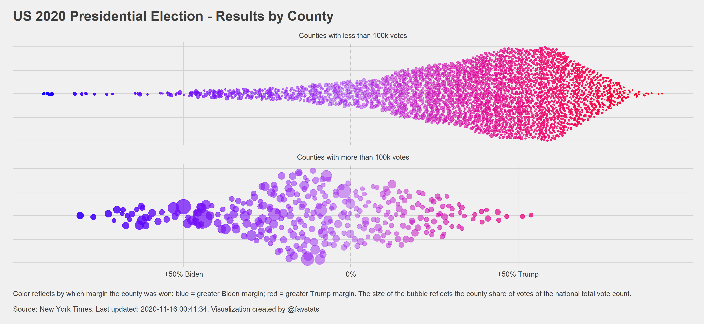
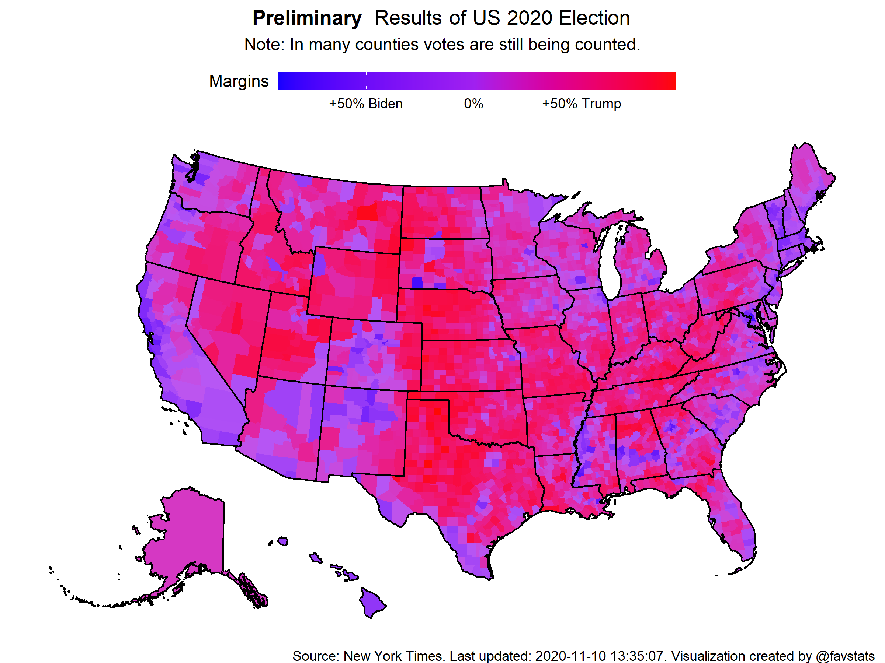
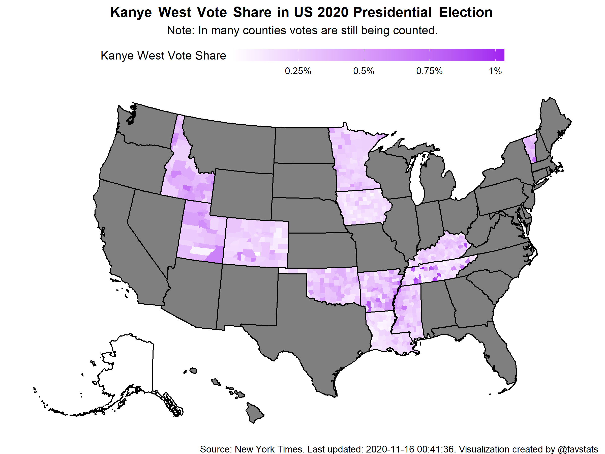

This repository provides access to New York Times election results on the county level. 

Every 24 hours it creates a new folder with the current date and time and downloads election results.

Just check the `data` folder and retrieve the csv file you want.

In addition, the latest file will be saved under `data/latest`. Note: after every iteration this file will be overwritten.

